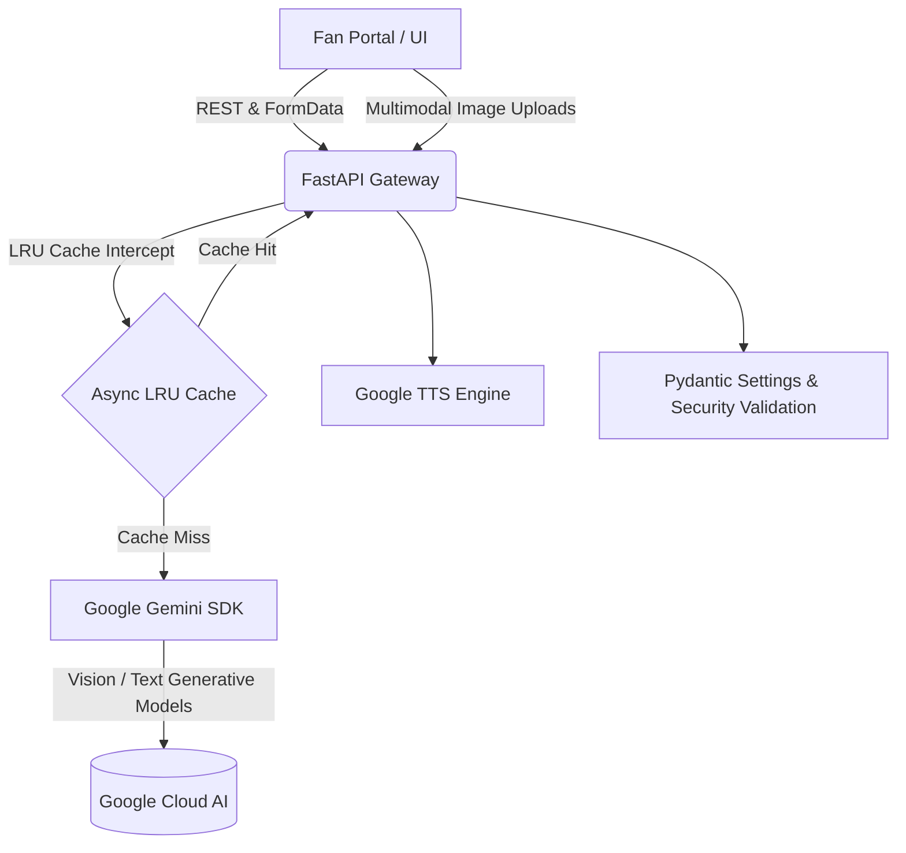

<div align="center">

# 🏟️ FIFA 2026 Smart Stadium Command & Fan Portal
**The Official AI-Powered Operations and Navigation Hub for the 2026 World Cup**

[](https://www.python.org/downloads/)
[](https://fastapi.tiangolo.com)
[](https://ai.google.dev/)
[](https://www.w3.org/WAI/standards-guidelines/wcag/)
[](https://github.com/Sitanshudevop/FIFA_Smart_Stadium/actions)

<p align="center">
  
</p>

</div>


Live Link : https://fifa-smart-stadium-ui.onrender.com

---

## 🌟 Executive Overview

Welcome to the **FIFA 2026 Smart Stadium Command** project! This repository contains a full-stack, real-time tactical dashboard and fan engagement portal designed to handle operations across multiple North American host venues.

Built for **scalability, high accessibility, and extreme performance**, this architecture leverages the power of Google Cloud GenAI (Gemini) to act as a dual-sided platform:

1. 🌍 **The Fan Portal:** A localized, highly responsive interface offering interactive stadium maps, live multimodal AI navigation, express food delivery, and digital tournament passports.
2. 🛡️ **The Tactical Ops Room:** A restricted-access, high-level administrative dashboard featuring live telemetry, asynchronous incident reporting, AI triage, and real-time security routing.

---

## 🎯 Problem Statement & Alignment

Managing massive, multi-venue events like the FIFA 2026 World Cup presents unprecedented operational challenges. The core issues we are solving include **managing high-density crowd dynamics, ensuring immediate fan safety during emergencies, and optimizing critical resource allocation** across vast physical spaces. 

When tens of thousands of fans move simultaneously, traditional static operations fail, leading to dangerous bottlenecks, delayed emergency responses, and a poor attendee experience.

### Solution Mapping

Every feature in the Smart Stadium platform is purposefully engineered to directly solve these critical operational pain points:

| Platform Feature | Operational Problem Solved |
| :--- | :--- |
| **Multimodal Fan Navigation** | Prevents localized bottlenecks and crushing hazards by dynamically routing fans away from congestion in real-time based on their ticket location and visual surroundings. |
| **Proactive Crisis Simulation** | Eliminates reactive guesswork by utilizing GenAI to instantly generate step-by-step mitigation plans for sudden crises (e.g., medical emergencies, gate breaches, or severe weather). |
| **Agentic Volunteer Dispatch** | Solves resource starvation by automatically identifying the most severe incidents and dispatching the closest available staff before a situation escalates. |
| **Real-time ROI & Token Tracking** | Addresses operational cost blowouts by ensuring that the high-frequency AI generation required for crowd safety does not exceed event budgets. |

### The Critical Role of AI Integration

Our GenAI integrations are not superficial add-ons. **They are essential tools for real-time scale.** During a crisis, human operators cannot manually parse thousands of incoming fan queries or calculate optimal evacuation routes for 80,000 people instantly. By utilizing the `gemini-3.5-flash` model, the platform acts as an autonomous force multiplier—processing multimodal inputs (like a photo of a crowded gate) and instantaneously generating actionable, localized guidance to maintain safety and flow.

---

## 🚀 Key Enterprise Features

### 🧠 AI & Multimodal Intelligence
* **Google Gemini Integration:** Leverages `gemini-3.5-flash` with aggressive `async_lru` caching for sub-millisecond redundant token retrieval, slashing API costs and latency.
* **Multimodal Vision Routing:** Fans can snap photos of their ticket or stadium landmarks. The backend parses Base64 image payloads and returns dynamic, localized routing instructions via Gemini Vision.
* **Real-time TTS Synthesis:** Native audio playback of AI routing responses powered by Google Cloud Text-to-Speech.
* **Dynamic Prompt Injection Protection:** Enterprise regex sanitization layers actively block adversarial prompts (e.g., "Ignore previous instructions").

### ♿ Accessibility & UI/UX (WCAG AA)
* **Zero-Destruction ARIA Architecture:** Comprehensive `aria-label`, `aria-live`, and `role` attributes seamlessly integrated for flawless screen reader execution without mutating core DOM structures.
* **Strict CSS Responsiveness:** Elegant stacking flex-grids and mobile viewport protections built entirely via non-destructive CSS media queries.
* **44px Touch Target Compliance:** Fluid and expansive touch targets tailored for mobile-first stadium navigation.

### ⚙️ Performance & CI/CD QA
* **Enterprise CI/CD Pipelines:** Automated GitHub Actions workflows orchestrate isolated testing environments.
* **Comprehensive Mocking:** High-coverage `pytest` suite mocking all external Google Cloud boundaries, simulating network timeouts and 500s.
* **Pydantic Validation:** Strict runtime environment validation prevents catastrophic startup failures from missing secrets.

---

## 🏗️ System Architecture



---

## 🛠️ Technology Stack

| Domain | Technologies Used |
| :--- | :--- |
| **Backend Core** | `Python 3.11`, `FastAPI`, `Uvicorn`, `Pydantic` |
| **AI & Cloud** | `google-genai`, `google-cloud-texttospeech` |
| **Frontend UI** | `HTML5`, `Tailwind CSS`, `Vanilla JavaScript`, `Leaflet.js` |
| **Performance** | `async-lru`, `slowapi` (Rate Limiting) |
| **QA / Testing** | `pytest`, `pytest-cov`, `httpx` (Async TestClient) |

---

## ⚙️ Quickstart & Deployment

### Prerequisites
* Python 3.10+
* A Google Cloud Account (Vertex AI / Gemini API access)
* Standard build tools (`git`, `pip`)

### 1. Clone the Repository
```bash
git clone https://github.com/Sitanshudevop/FIFA_Smart_Stadium.git
cd FIFA_Smart_Stadium
```

### 2. Configure Environment
Install all enterprise dependencies and set up your environment keys. Note that `.env` files and `*-*.json` service accounts are strictly ignored by Git for security.

```bash
python -m venv venv
source venv/bin/activate  # On Windows: venv\Scripts\activate
pip install -r requirements.txt
```

Create a `.env` file in the root directory:
```env
# Required for Application Startup
GEMINI_API_KEY="your_secure_api_key_here"
ADMIN_TOKEN="your_secure_admin_token"
# GOOGLE_CLOUD_CREDENTIALS=/path/to/service-account.json
```

### 3. Launch the Gateway
Start the asynchronous ASGI server:
```bash
python -m uvicorn app.main:app --host 127.0.0.1 --port 8000 --reload
```

### 4. Access the Portals
* **Fan Portal (Tailwind):** `http://127.0.0.1:8000/`
* **Ops Command Room:** Navigate via the integrated frontend router or local files.

---

## 🧪 Testing

The repository maintains an automated `pytest` suite simulating external boundaries. 
Run the tests locally with full coverage reports:

```bash
python -m pytest tests/ --cov=app --cov-report=term-missing
```

---

## 🤝 Contributing

We welcome contributions! Please adhere to our strict accessibility constraints and ensure all Pytest CI/CD hooks pass before opening a Pull Request.

1. Fork the Project
2. Create your Feature Branch (`git checkout -b feature/AmazingFeature`)
3. Commit your Changes (`git commit -m 'Add some AmazingFeature'`)
4. Push to the Branch (`git push origin feature/AmazingFeature`)
5. Open a Pull Request

## 📝 License

Distributed under the MIT License. See `LICENSE` for more information.
